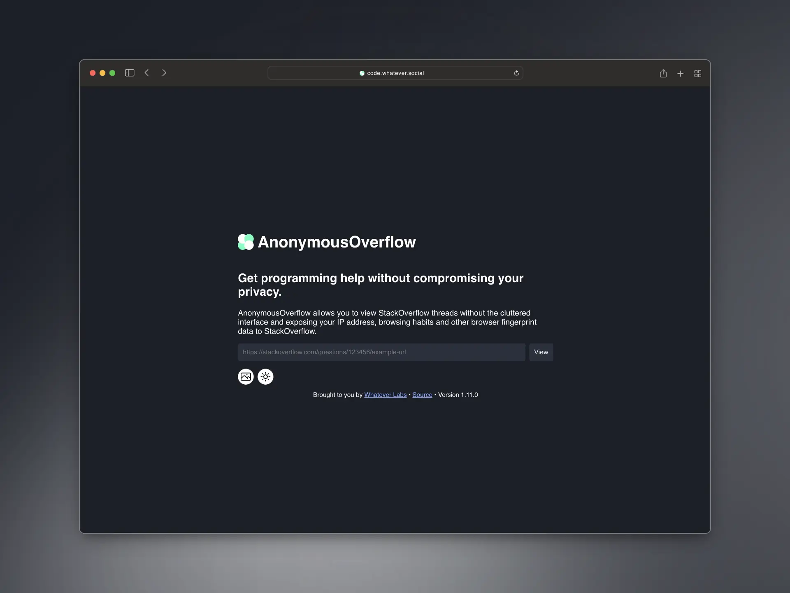
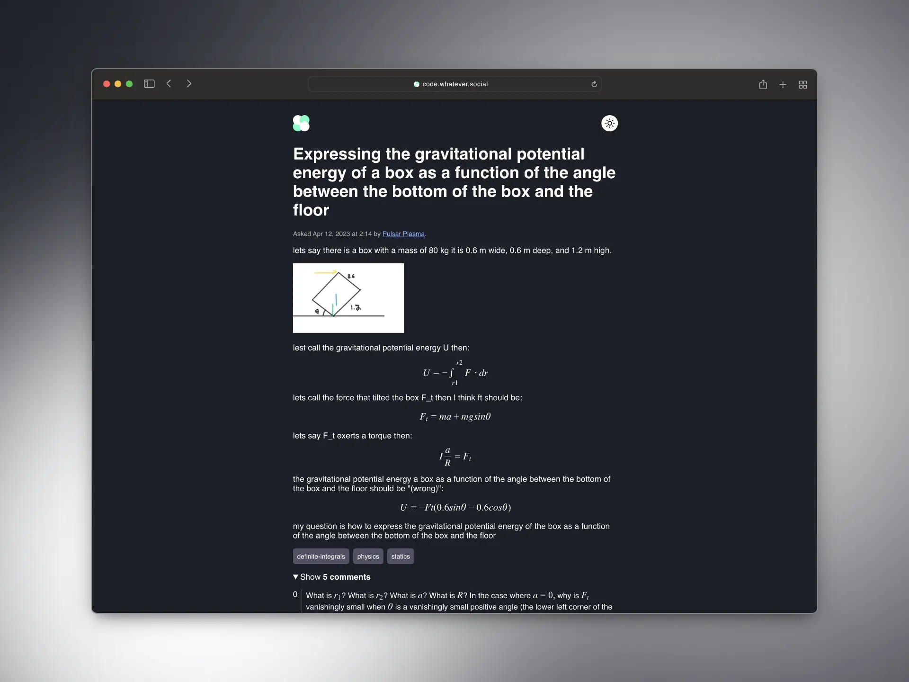
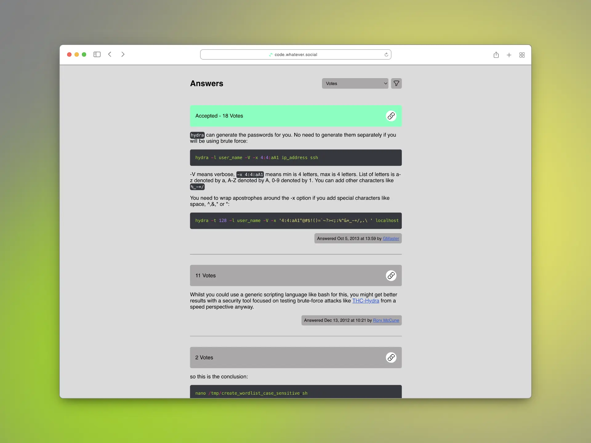

# AnonymousOverflow

AnonymousOverflow allows you to view StackOverflow threads without the cluttered interface and exposing your IP address, browsing habits and other browser fingerprint data to StackOverflow.

This project is super lightweight by design. The UI is simple and the frontend is served as an SSR HTML requiring no JavaScript.

## Screenshots







## Instances

Visit the [AnonymousOverflow Hub](https://aohub.httpjames.space) for a list of instances.

## Why use AnonymousOverflow over StackOverflow?

-   StackOverflow collects a lot of information

While it's understandable that StackOverflow collects a lot of technical data for product development, debugging and to serve the best experience to its users, not everyone wants their

> internet protocol (IP) address, [...] browser type and version, time zone setting and location, browser plug-in types and versions, operating system, and platform [...] data

to be collected and stored.

-   StackOverflow shares your information with third-parties

StackOverflow does not sell your information, but it does share it with third-parties, including conglomerates.

> We also partner with other third parties, such as Google Ads and Microsoft Bing, to serve advertising content and manage advertising campaigns. When we use Google Ads or Microsoft Bing Customer Match for advertising campaigns, your personal data will be protected using hashed codes.
> Google users can control the ads that they see on Google services, including Customer Match ads, in their Google Ads Settings.

Their main website also [contains trackers from Alphabet](https://themarkup.org/blacklight?url=stackoverflow.com).

-   Reduced clutter

StackOverflow has a cluttered UI that might distract you from the content you're trying to find. AnonymousOverflow simplifies the interface to make it easier to read and navigate.

## How to make Stack Overflow links take you to AnonymousOverflow automatically

The open-source [Libredirect](https://github.com/libredirect/libredirect) extension for Firefox and Chromium-based desktop browsers has support for redirections to AnonymousOverflow. To enable this, simply open the extension settings, click on Stack Overflow, then toggle "Enable". That's it, now Stack Overflow links will go to AnonymousOverflow.

The open-source [FREEdirector](https://openuserjs.org/scripts/sjehuda/FREEdirector) user.js script for web browsers with userscript support. You can install it with a web extension like [Greasemonkey](https://greasespot.net/), [Tampermonkey](https://tampermonkey.net/) or [Violentmonkey](https://violentmonkey.github.io/). Once installed, Stack Overflow links will go to AnonymousOverflow.

## How it works

AnonymousOverflow uses the existing question endpoint that StackOverflow uses. Simply replace the domain name in the URL with the domain name of the AnonymousOverflow instance you're using and you'll be able to view the question anonymously.

Example:

```
https://stackoverflow.com/questions/43743250/using-libsodium-xchacha20-poly1305-for-large-files
```

becomes

```
${instanceURL}/questions/43743250/using-libsodium-xchacha20-poly1305-for-large-files
```

### Bookmark Conversion Tool

You can easily convert StackOverflow URLs to AnonymousOverflow ones by adding the following code as a bookmark in your web browser:

```js
javascript: (function () {
    window.location = window.location
        .toString()
        .replace(/stackoverflow\.com/, 'code.whatever.social')
})()
```

Replace `code.whatever.social` with the domain name of the instance you're using if needed.

You can run this bookmarklet on any StackOverflow page to view it anonymously.

Thanks to [Manav from ente.io](https://ente.io/about) for the handy tool.

## How to deploy

Read the [wiki page](https://github.com/httpjamesm/AnonymousOverflow/wiki/Deployment).

## Attribution

-   Icons provided by [heroicons](https://heroicons.com) under the [MIT License](https://choosealicense.com/licenses/mit/)
-   [Gin](https://github.com/gin-gonic/gin) under the [MIT License](https://github.com/gin-gonic/gin/blob/master/LICENSE)
-   [goquery](https://github.com/PuerkitoBio/goquery) under the [BSD 3-Clause License](https://github.com/PuerkitoBio/goquery/blob/master/LICENSE)
-   [resty](https://github.com/go-resty/resty) under the [MIT License](https://github.com/go-resty/resty/blob/master/LICENSE)
-   [Chroma](https://github.com/alecthomas/chroma) under the [MIT License](https://github.com/alecthomas/chroma/blob/master/COPYING)
-   [KaTeX](https://github.com/KaTeX/KaTeX) under the [MIT License](https://github.com/KaTeX/KaTeX/blob/main/LICENSE)
